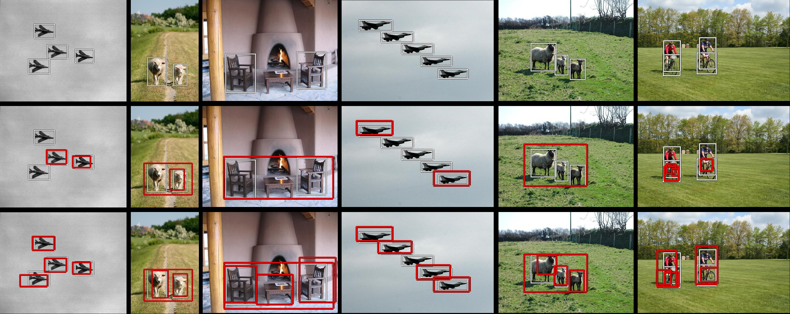

# Toward unsupervised, multi-object discovery in large-scale image collections

Huy V. Vo, Patrick Pérez, Jean Ponce - ECCV 2020



Video presentation: [https://www.youtube.com/watch?v=v2vzEXOvUMs&feature=youtu.be](https://www.youtube.com/watch?v=v2vzEXOvUMs&feature=youtu.be)

### Getting started

The code is written and tested with Matlab 2017a. Modifications might be necessary to run it with other versions of Matlab.

You need a GPU to extract features from pre-trained VGG19.

### Installing 

```
git clone https://github.com/vohuy93/rOSD.git
```

```
cd rOSD; mkdir data
```

## Running the tests

Download [VGG19 model](https://www.vlfeat.org/matconvnet/models/imagenet-vgg-verydeep-19.mat) and put it in `data/.matconvnet/models`.

Download the VOC_6x2 dataset [here](https://drive.google.com/drive/folders/191WgX9fkrXr-AUVdIh57QWaEEXuaZzre?usp=sharing) and put it in `data`. As a sanity check, you should have the file `data/vocx/aeroplane_left/aeroplane_left.mat`. 

The main scripts for testing the code on VOC_6x2 are [run_proposals.m](run_proposals.m), [run_scores.m](run_scores.m) and [run_rOSD.m](run_rOSD.m). In matlab, from the rOSD folder, run 

```
set_path; run_proposals; run_scores; run_rOSD;
```

For a quick test, you can use the precomputed scores instead. In matlab, from the rOSD folder, run

```
set_path; run_proposals;
```   

Download [the scores](https://drive.google.com/drive/folders/1Q9mCnD9MIO0-CA6LvYvPR8JWSllDJSFX?usp=sharing) and put them in `data/vocx_cnn` by class, then from the rOSD folder, run

```
set_path; run_rOSD;
```


## Citations

```
@INPROCEEDINGS{Vo20rOSD,
  title     = {Toward unsupervised, multi-object discovery in large-scale image collections},
  author    = {Vo, Huy V. and P{\'e}rez, Patrick and Ponce, Jean},
  booktitle = {Proceedings of the European Conference on Computer Vision ({ECCV})},
  year      = {2020}
}
```

## License

This project is licensed under the MIT License - see the [LICENSE](LICENSE) file for details.

## Acknowledgments

The code for Probabilistic Hough Matching (PHM) algorithm is taken from the [project page](https://www.di.ens.fr/willow/research/objectdiscovery/) of the paper "Unsupervised Object Discovery and Localization in the Wild".

The code for OSD and rOSD are modified from [our previous project](https://github.com/huyvvo/OSD).

We use [MatConvNet](https://www.vlfeat.org/matconvnet/) for running neural networks on Matlab. 

This work was supported in part by the Inria/NYU collaboration, the Louis Vuitton/ENS chair on artificial intelligence and the French government under management of Agence Nationale de la Recherche as part of the “Investissements d’avenir” program, reference ANR19-P3IA-0001 (PRAIRIE 3IA Institute). Huy V. Vo was supported in part by a Valeo/Prairie CIFRE PhD Fellowship.
